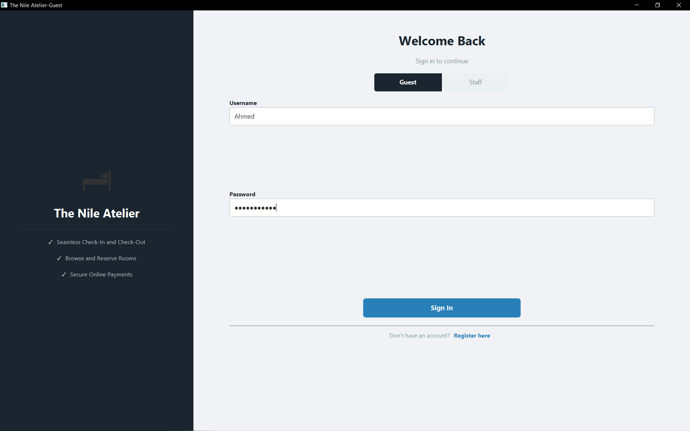
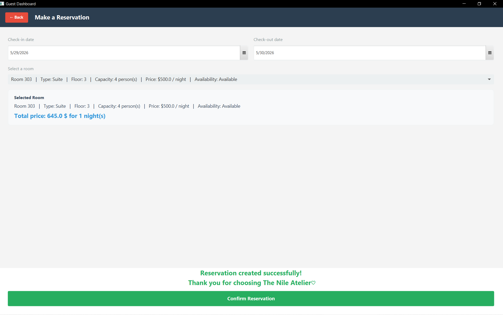
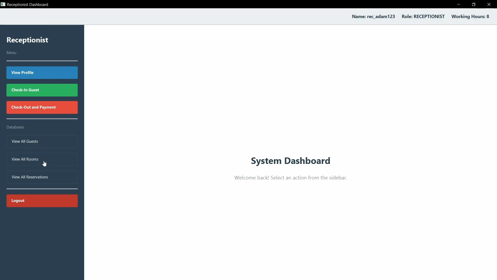
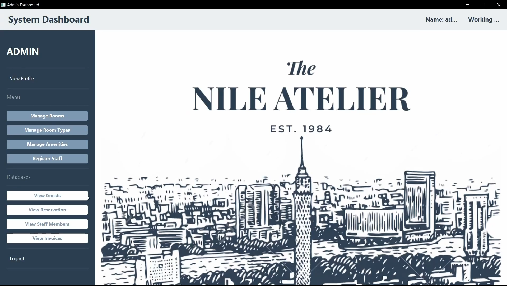
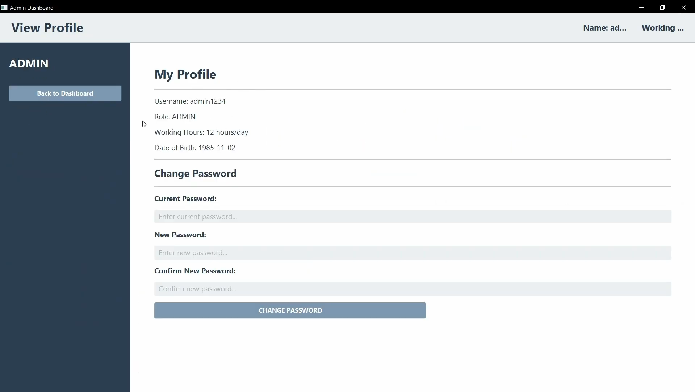
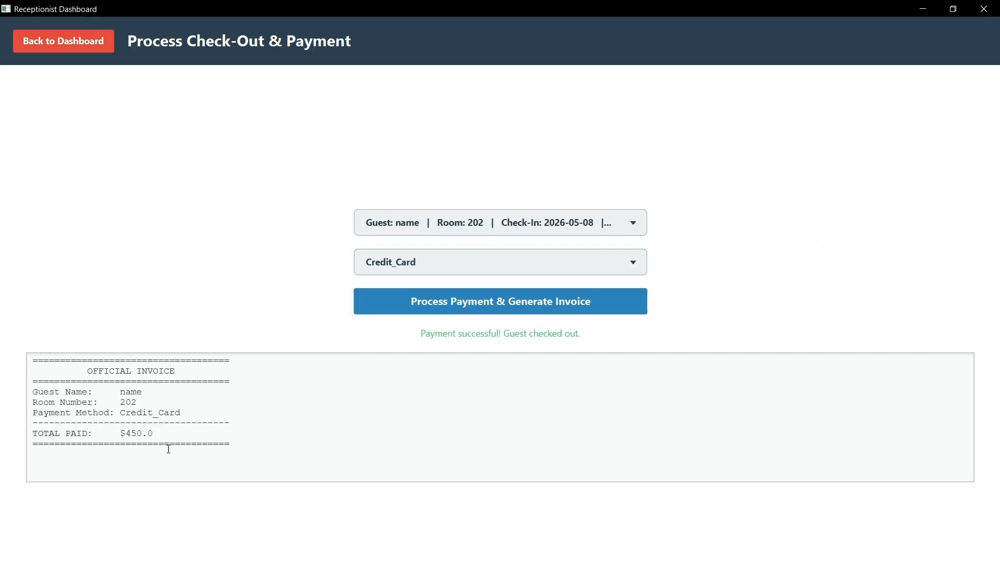
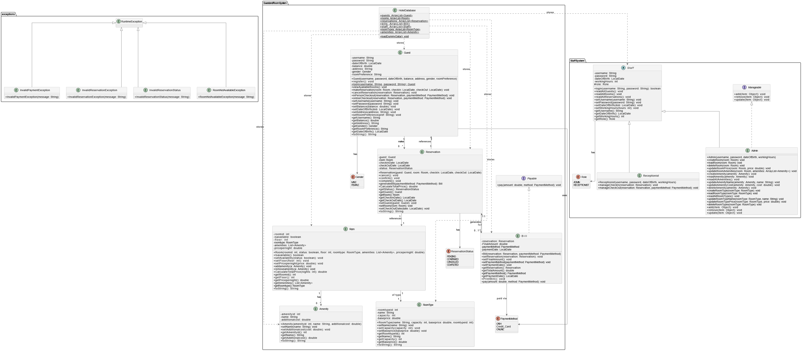

# The Nile Atelier — Hotel Management System

A Java Object-Oriented Programming course project that simulates a hotel management workflow for guests, receptionists, and admins. The system combines a Java backend with a JavaFX desktop GUI to manage rooms, reservations, guests, staff accounts, and checkout/payment operations.

> Built as a team project for an OOP course.

---

## Preview

### Demo Video

[[Watch the demo]](https://www.youtube.com/watch?v=sGeCcVbCXbA&t)

### Screenshots

| Login / Register | Making resirvation  | Receptionist Dashboard                                |
|---|---------------------------------------------------|-------------------------------------------------------|
|  |  |  |

| Admin Dashboard | View account                                     | Checkout / Payment |
|---|--------------------------------------------------|---|
|  |  |  |

---

## Project Overview

The system is designed around real hotel entities such as guests, rooms, room types, amenities, reservations, bills, admins, and receptionists. It allows different users to interact with the hotel system depending on their role.

Guests can register, log in, browse available rooms, make reservations, view their reservation history, cancel reservations, and complete checkout/payment. Receptionists can view guest, room, and reservation data, manage check-ins, and handle check-outs. Admins can manage hotel data such as rooms, room types, amenities, staff members, and system records.

The project uses an in-memory database implemented with `ArrayList` collections, making it simple to test without requiring an external database setup.

---

## Main Features

### Guest Features

- Guest registration and login
- Guest dashboard with profile and balance details
- Browse available rooms
- Filter rooms by room type, amenities, and price
- Make reservations with check-in and check-out dates
- View reservations by status
- Cancel reservations
- Checkout and payment flow

### Receptionist Features

- Receptionist dashboard
- View receptionist profile
- View all guests
- View all rooms
- View all reservations
- Manage guest check-in
- Manage check-out and payment

### Admin Features

- Admin dashboard
- Manage rooms
- Manage room types
- Manage amenities
- Register staff members
- View guests, reservations, staff, and bills
- View and update admin profile details

### Backend Features

- In-memory hotel database using `ArrayList`
- Reservation status tracking
- Bill generation
- Room availability handling
- Input validation
- Custom exception handling
- Role-based staff structure

---

## Technologies Used

- **Java**
- **JavaFX**
- **FXML**
- **CSS** for GUI styling
- **Object-Oriented Programming principles**
- **Git / GitHub**

---

## OOP Concepts Applied

### Encapsulation

Core classes use private attributes with getters and setters to control access and validate data before changing object state.

Examples:

- `Guest`
- `Room`
- `Reservation`
- `RoomType`
- `Staff`

### Inheritance

The staff system uses inheritance to avoid duplicated code between different staff roles.

```text
Staff
├── Admin
└── Receptionist
```

`Staff` stores shared staff data such as username, password, date of birth, working hours, and role. `Admin` and `Receptionist` extend it with role-specific behavior.

### Abstraction

`Staff` is implemented as an abstract class, representing the shared idea of a hotel employee while allowing specific staff types to define their own responsibilities.

### Enums

Enums are used instead of raw strings for fixed values, making the system safer and easier to read.

Examples:

- `Gender`
- `PaymentMethod`
- `ReservationStatus`
- `Role`

### Exception Handling

Custom runtime exceptions are used to handle invalid business cases clearly.

Examples:

- `RoomNotAvailableException`
- `InvalidReservationException`
- `InvalidPaymentException`
- `InvalidReservationStatus`

---

## Project Structure

```text
Hotel_oop/
├── src/
│   ├── GuestandRoomSystem/
│   │   ├── Amenity.java
│   │   ├── Bill.java
│   │   ├── Gender.java
│   │   ├── Guest.java
│   │   ├── HotelDatabase.java
│   │   ├── PaymentMethod.java
│   │   ├── Reservation.java
│   │   ├── ReservationStatus.java
│   │   ├── Room.java
│   │   └── RoomType.java
│   │
│   ├── StaffSystem/
│   │   ├── Admin.java
│   │   ├── Receptionist.java
│   │   ├── Role.java
│   │   └── Staff.java
│   │
│   ├── exceptions/
│   │   ├── InvalidPaymentException.java
│   │   ├── InvalidReservationException.java
│   │   ├── InvalidReservationStatus.java
│   │   └── RoomNotAvailableException.java
│   │
│   └── GUI/
│       ├── CODE/
│       │   ├── LoginMain.java
│       │   └── MainFX.java
│       ├── Controllers/
│       ├── CSS/
│       └── FXML/
│
├── UML_Diagram.png
├── ProjectReport.docx
└── README.md
```

---

## Main Classes

### `HotelDatabase`

Acts as the in-memory storage layer for the application. It stores collections of guests, rooms, reservations, bills, staff members, room types, amenities, and sample data.

### `Guest`

Represents a hotel guest. Handles guest registration, login, viewing available rooms, making reservations, canceling reservations, and checkout/payment operations.

### `Room`

Represents a hotel room with a room number, floor, availability status, room type, amenities, and price per night.

### `RoomType`

Represents the category of a room, including the room type name, capacity, base price, and ID.

### `Reservation`

Connects a guest with a room and stores check-in date, check-out date, and reservation status. It also calculates total price and generates bills.

### `Bill`

Represents payment information for a completed reservation, including reservation details, final amount, payment method, and payment date.

### `Staff`

An abstract base class for hotel employees. Stores common staff data and shared methods.

### `Admin`

Handles admin-related actions such as managing rooms, room types, amenities, staff registration, and viewing bills.

### `Receptionist`

Handles receptionist-related actions such as confirming reservations, managing check-ins, and completing check-outs.

---

## How to Run

### Requirements

- Java JDK installed
- JavaFX SDK installed and configured
- An IDE such as IntelliJ IDEA or VS Code

### Main Entry Point

Run one of the JavaFX launcher classes:

```text
src/GUI/CODE/MainFX.java
```

or

```text
src/GUI/CODE/LoginMain.java
```

`HotelDatabase.loadDummyData()` is used to load sample rooms, guests, staff members, reservations, and bills before opening the GUI.

### Demo Login Data

The project includes sample data for testing. Example accounts can be found in:

```text
src/GuestandRoomSystem/HotelDatabase.java
```

Examples from the dummy data include:

```text
Guest username: Ahmed
Guest password: password123

Guest username: Fady
Guest password: fadyfady

Admin username: admin1234
Admin password: adminpassword

Receptionist username: rec_adam123
Receptionist password: receptionist1
```

---

## UML Diagram

The project includes a UML diagram showing the main backend relationships.



---

## My Contributions

> Edit this section to match your exact work before publishing.

My main contributions included:

- Implementing and organizing the `HotelDatabase` logic
- Working on custom exception classes
- Building and connecting the receptionist dashboard GUI
- Connecting GUI actions to backend data where needed
- Helping prepare the project for presentation and discussion

---

## Team Project Note

This project was developed as a team project for an Object-Oriented Programming course. The repository represents collaborative work, with different members contributing to backend logic, GUI screens, reservation handling, staff functionality, and system design.

---

